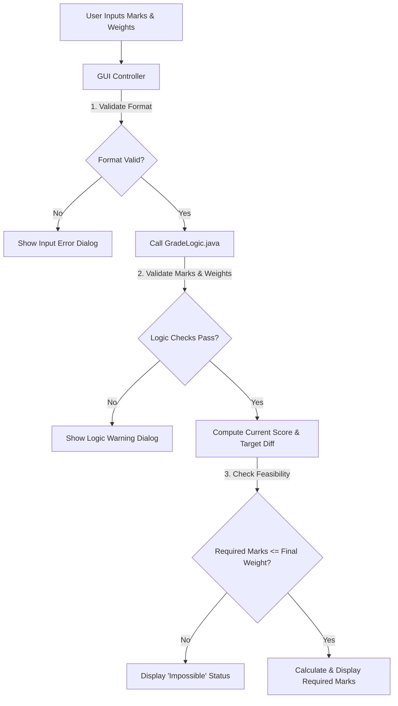

# 🎯 Target Grade Forecaster

[](https://www.oracle.com/java/)
[](https://docs.oracle.com/javase/tutorial/uiswing/)
[](https://junit.org/junit4/)
[](https://www.eclipse.org/)

A professional, lightweight **desktop application** written in Java using Swing. The **Target Grade Forecaster** helps university students determine exactly what marks they need to achieve in their Final Exams to secure their desired letter grade (e.g., A, B+, C-). By inputting their internal assessment scores (Mids, Quizzes, Assignments, CP/Project) along with their respective syllabus weightages, the system performs precise projections and validation.


## ✨ Key Features

- **📊 Comprehensive Internal Assessment Input:** Handles Mid-terms, Quizzes, Assignments, and Class Participation (CP) / Project marks.
- **⚡ Real-time Target Forecasting:** Calculates the exact score required in the final exam based on the chosen target letter grade.
- **🛡️ Robust Input Validation:**
  - Automatically checks that obtained marks do not exceed maximum total marks.
  - Ensures the cumulative weightages of all components (Mids + Quizzes + Assignments + CP + Final) sum up to exactly **100%**.
- **🧩 Refactored Modular Architecture:** Strictly follows the Separation of Concerns (SoC) principle by separating the graphical user interface (`GradeCalculatorGUI.java`) from the core mathematical and validation logic (`GradeLogic.java`).
- **🧪 Automated Unit Testing:** Includes unit test suites (`GradeLogicTest.java`) built with JUnit 4 to cover normal operations, edge cases, and invalid inputs.
- **⚠️ Interactive Error Handling:** Displays user-friendly warning dialogs for format issues (`NumberFormatException`) and logic issues (`IllegalArgumentException`).

---

## 📐 System Architecture & Data Flow

The application is structured into three main components:
1. **Presentation Layer (`GradeCalculatorGUI.java`)**: Manages the Swing elements, listens to user actions, and displays outputs or error dialogs.
2. **Business Logic Layer (`GradeLogic.java`)**: Performs validation checks and runs the forecasting algorithms.
3. **Testing Layer (`GradeLogicTest.java`)**: Assures core logic correctness.



---

## 🗂️ Project Structure

```
SCD-Grade-Calculator/
│
├── .settings/                # Eclipse project configuration settings
├── assets/                  # Documentation assets & images
│   └── ui_preview.png       # UI design preview mockup
├── bin/                     # Compiled class files (.class)
├── src/                     # Java source code (.java)
│   ├── GradeCalculatorGUI.java   # Swing-based User Interface
│   ├── GradeLogic.java           # Math formula and validation rules
│   └── GradeLogicTest.java       # JUnit 4 automated tests
│
├── .classpath               # Eclipse classpath config
├── .project                 # Eclipse project descriptor
└── README.md                # Project documentation (this file)
```

---

## 🚀 How to Set Up and Run

### Option A: Using Eclipse IDE (Recommended)

1. **Clone the Repository:**
   ```bash
   git clone https://github.com/saaddev2004/GradeCalculator-SCD-Project-.git
   ```
2. **Import/Create Project in Eclipse:**
   - Open Eclipse IDE.
   - Go to `File` -> `New` -> `Java Project`.
   - Name the project `SCD-Grade-Calculator` and use the cloned folder as the project location, or copy the files in `src/` to your existing project.
3. **Configure JUnit 4 Build Path:**
   - Right-click on the project folder in the *Package Explorer*.
   - Navigate to `Build Path` -> `Add Libraries...`.
   - Choose `JUnit` -> `Next` -> Choose `JUnit 4` -> `Finish`.
4. **Execute the Application:**
   - Right-click `GradeCalculatorGUI.java` -> `Run As` -> `Java Application`.
5. **Run Test Suite:**
   - Right-click `GradeLogicTest.java` -> `Run As` -> `JUnit Test`.

---

### Option B: Using the Command Line (CLI)

Ensure you have **Java JDK 11 or higher** installed.

1. **Navigate to the Project Root:**
   ```bash
   cd SCD-Grade-Calculator
   ```
2. **Compile Java Files:**
   ```bash
   javac -d bin src/GradeLogic.java src/GradeCalculatorGUI.java
   ```
3. **Run the Application:**
   ```bash
   java -cp bin GradeCalculatorGUI
   ```

---

## 📝 Grading Reference Scale

The system maps target grades to minimum required percentage thresholds according to the following academic standard:

| Letter Grade | Minimum Percentage |
| :---: | :---: |
| **A** | 85% |
| **A-** | 80% |
| **B+** | 75% |
| **B** | 71% |
| **B-** | 68% |
| **C+** | 64% |
| **C** | 61% |
| **C-** | 58% |
| **D+** | 54% |
| **D** | 50% |
| **F** | 0% |

---

## 🧪 Testing Coverage

The automated JUnit test cases (`GradeLogicTest.java`) cover:
- **`testGetTargetScore`**: Verifies minimum percentage mapping for grade letters (e.g. `A` -> `85.0`, `F` -> `0.0`).
- **`testInvalidWeightage`**: Verifies that an `IllegalArgumentException` is thrown if cumulative weightage is not equal to exactly 100%.
- **`testInvalidMarks`**: Verifies that an `IllegalArgumentException` is thrown when obtained marks are larger than total marks.
- **`testCalculateCurrentScore`**: Tests correct scaling calculation for marks weighted values.

---

## 🤝 Contributors

- **Muhammad Saad** (Lead Developer)
- Developed as a final project for the **Software Construction & Development (SCD) Lab**, 6th Semester.
